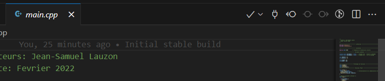

# LienArduinoPC 🐀
Projet pour la démo de la connection entre le PC et l'Arduino pour le projet de session S2.

## Setup
This projet has two sub projects. 

### PC_to_Arduino
The first one is `PC_to_Arduino` which works best with Visual Studio 2019. To open this, simply open the `PC_Project.sln` file and everything should be up and running.

### ArduinoProject
This contains the code that is meant to be pushed to the Arduino Mega. This project works best with Visual Studio Code with the Platform.io extension. To use, open the entire folder with VS Code and you should see the checkmark on the top right corner. 

## Closing words

